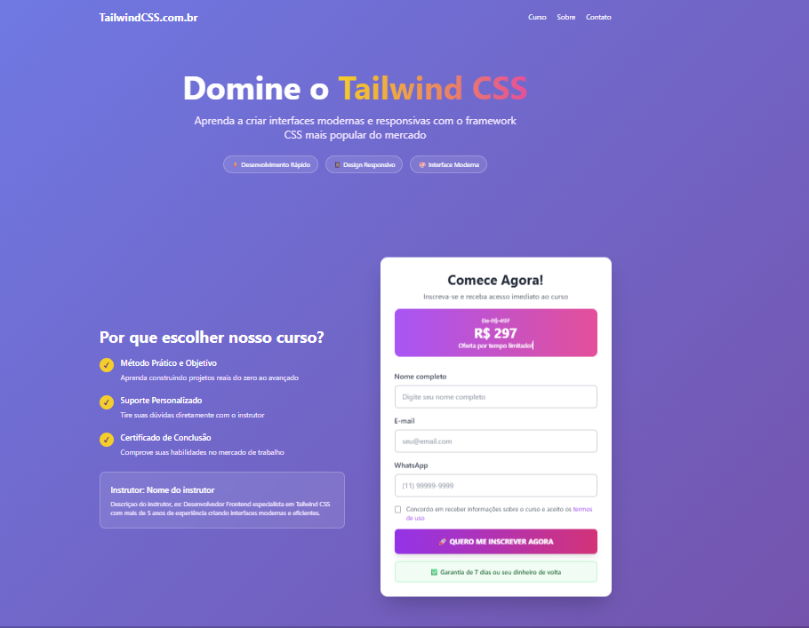
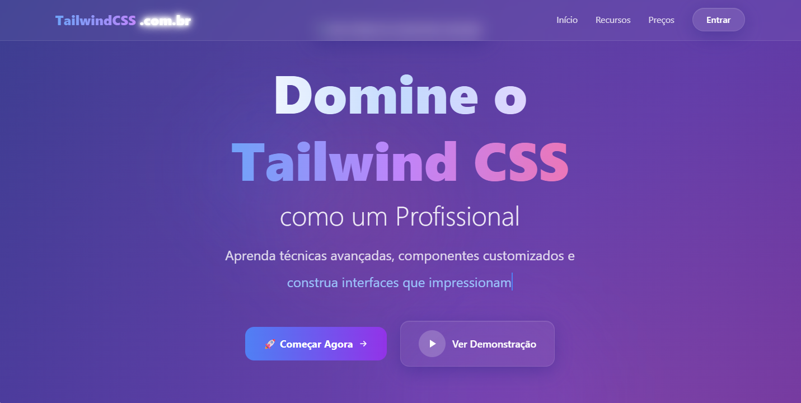
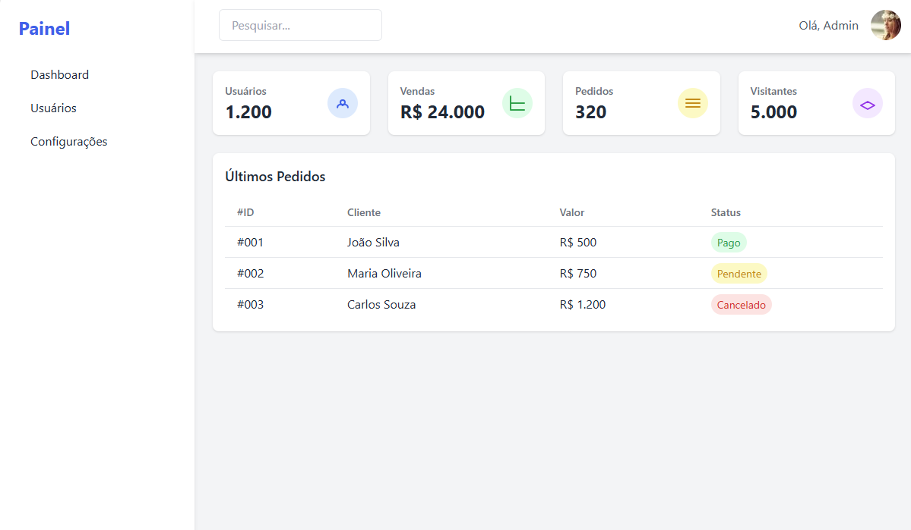

# 🎨 Exemplos Tailwind CSS — tailwindcss.com.br

Repositório oficial de exemplos visuais utilizados no [TailwindCSS.com.br](https://tailwindcss.com.br) — a plataforma brasileira para quem quer dominar o framework Tailwind CSS com didática, componentes prontos e projetos reais.

Este repositório inclui templates completos para estudo e uso livre, tanto para iniciantes quanto para desenvolvedores avançados.

---

## 📦 O que você encontrará aqui?

### 🔹 Landing Pages

**Landing Page Básica**



**Landing Page Premium**



---

### 🔹 Admin Panels

**Painel Admin Básico**



**Painel Admin Premium**


---

## 🚀 Como usar

1. Clone o repositório:

```bash
git clone https://github.com/seuusuario/tailwind-exemplos.git
cd tailwind-exemplos
